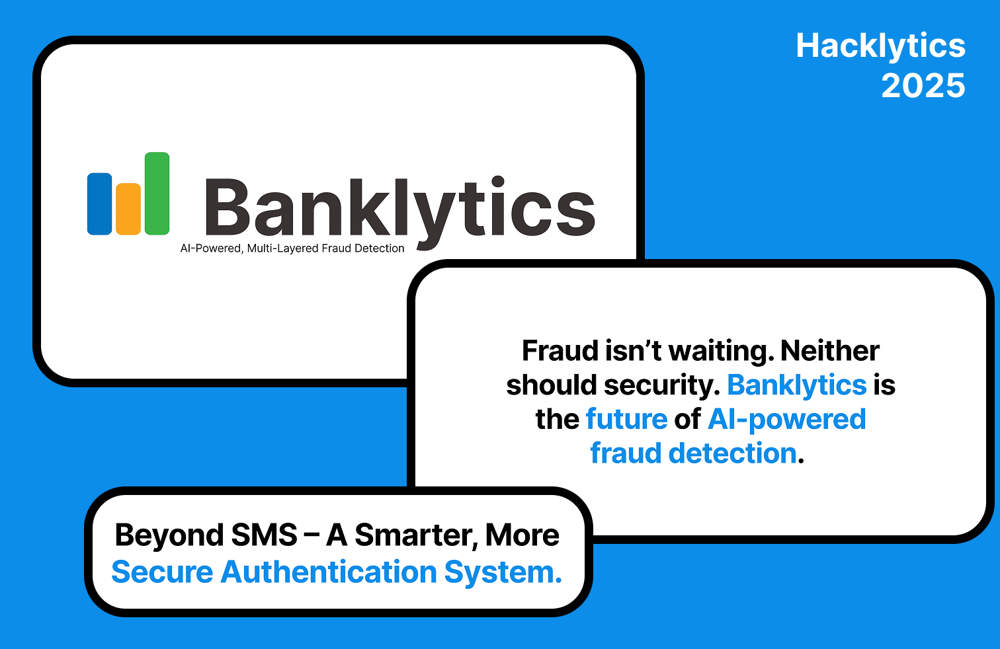

# **Banklytics: AI-Powered Fraud Detection & Multi-Layer Authentication**

## **💡 Inspiration**

Fraud prevention today relies on **easily bypassed SMS alerts**, which can be hijacked through **SIM swaps, phishing, and malware**. But what happens when AI-generated scams, voice cloning, and deepfake fraud enter the picture? Current systems **aren’t built to handle next-gen fraud attacks.**

That’s why we built **Banklytics**—an AI-driven fraud detection system that **thinks faster than fraudsters, reacts in real-time, and authenticates users without needing Face ID, fingerprint scanning, or a smartphone.**

## **🔐 What It Does**

- **🚀 Instant ML-Based Risk Scoring** – Every transaction is analyzed in real time.
- **📞 AI-Powered Phone Call Verification** – No more weak SMS codes; we call you directly.
- **🗣 Voice Authentication for Identity Confirmation** – Say “Yes” or “No” to verify transactions.
- **📡 Works Without Biometrics or Smartphones** – No Face ID? No fingerprint scanner? No problem. Banklytics works on **any phone with a microphone and speaker.**
- **📲 Optional App-Based Facial Recognition for Extra Security** – If the user has a smartphone, we can add a second layer of security with facial recognition.
- **🌎 Future-Ready Edge Data** – (Location, IP, device fingerprinting) for **next-gen fraud detection.**

## **⚙️ How We Built It**

- **ML Risk Analysis** – Transaction scoring model trained on **synthetic data (soon: real bank data!).**
- **Voice Authentication** – AI-driven phone call with voice matching for **fraud detection beyond SMS.**
- **Real-Time Processing** – Event-driven pipeline using **serverless tech for instant response times.**
- **Admin Dashboard** – Next.js & TailwindCSS for a **clean, modern UI** that tracks fraud trends.

## **⚠️ The Challenges We Faced**

- **Real-Time Complexity** – Making AI phone calls + ML risk scoring happen in milliseconds.
- **Preventing AI Voice Cloning** – Voice spoofing is **too easy nowadays** (see Future Upgrades).
- **Balancing Security & User Experience** – Fraud detection **must be strong but frictionless.**

## **🏆 What We’re Proud Of**

- **First-ever AI-driven banking phone call fraud system.**
- **Multi-layer security WITHOUT needing built-in biometrics like Face ID or fingerprint scanning.**
- **A scalable fraud detection pipeline built in just a hackathon weekend.**

## **🤯 What We Learned**

- **SMS-based authentication is obsolete.**
- **Fraud evolves fast—security must move faster.**
- **Security shouldn’t depend on expensive devices—everyone deserves fraud protection.**

## **🚀 Future Upgrades & Differentiation from Banking Apps**

### **🔍 How We’re Better Than a Regular Banking App**

1. **No smartphone? No problem.** – Unlike Face ID-dependent banking apps, **Banklytics works on ANY phone** that can receive a call.
2. **No fingerprint scanner? No problem.** – We **don’t require** any built-in biometrics; **voice authentication is the core verification method.**
3. **AI voice cloning makes phone-based fraud worse** – We use **additional fraud detection techniques** (see below).
4. **Banking apps require manual logins** – Our fraud detection is **automatic & instant** with **real-time calls** instead of passive app notifications.
5. **We integrate fraud analysis for banks directly** – Not just a user-facing app, but a **full-stack fraud detection system** banks can plug into their existing infrastructure.

### **🛡 Future Enhancements**

- **🔬 Voice Liveness Detection:** (to stop AI voice spoofing)
  - Require **randomized spoken phrases** instead of just "yes" or "no."
  - Detect **background noise inconsistencies** (AI-generated voices sound too clean).
  - Use **intonation analysis** (AI voices struggle with natural human tone changes).
- **👁 Optional Facial Recognition for High-Risk Cases:**
  - **For users with smartphones,** we add an optional second layer: facial verification.
  - Implement **blink detection & microexpressions** (AI-generated deepfake faces don’t blink naturally).
  - Require **active user response** (e.g., "turn your head left") for real-time authentication.
- **🌍 Full Edge Data Integration:**
  - **Device fingerprinting:** Identify fraud attempts based on **device history & IP anomalies.**
  - **Behavioral biometrics:** Track user habits (e.g., typing speed, purchase history) to spot **suspicious deviations.**

## **💭 What’s Next for Banklytics?**

- **Partnering with fintech companies to integrate our fraud system with real banking APIs.**
- **Deploying a working prototype that banks can test in live environments.**
- **Expanding edge data analysis to enhance fraud detection accuracy.**

Fraud isn’t waiting. Neither should security. **Banklytics is the future of AI-powered fraud detection.** 🔥
